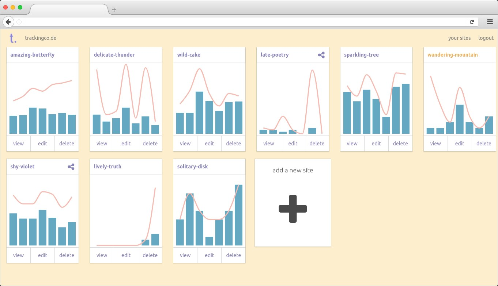

# trackingco.de: a simple web analytics service

trackingco.de is web-analytics without the interface bloat, the cognitive load, the webpage slowness. If you are tired of Google Analytics and Piwik seems even worse to your humble analytics needs, trackingco.de is for you.



## Live demo

A demo of the interface can be seem at https://trackingco.de/public/mzfzx9 (with real data from https://github.com/fiatjaf/module-linker).

## If you don't want to run it by yourself

A hosted version is available and live and going well at https://trackingco.de/ with super-cheap pricing. You can create an account there and be welcome.

## How to run it

To start, you'll need the following ingredients:

  * a server capable of running [Go](https://golang.org/) apps ([Heroku](https://www.heroku.com/) will do it)
  * a [CouchDB](http://couchdb.apache.org/) database (you can get one for free at [Cloudant](cloudant.com))
  * a [Redis](https://redis.io/) database ([redislabs](https://redislabs.com/) has them for free)
  * a [PostgreSQL](https://www.postgresql.org/) database (which are offered for free at [Heroku Postgres](https://www.heroku.com/postgres))

### Go app backend

So get this repository with a `git clone` or `go get github.com/fiatjaf/trackingco.de`, go to your `$GOPATH/github.com/fiatjaf/trackingco.de` and fill in the following variables in a `.env` file:

```env
HOST= # your server hostname and port
COUCH_URL= # the URL (with user and password) to the CouchDB server
COUCH_DATABASE= # the name of the Couch database you're using
DATABASE_URL= # the full postgres:// URL to your Postgres database
REDIS_ADDR= # the URL to the Redis database
REDIS_PASSWORD= # the Redis database password
SESSION_OFFSET_HASHID_SALT= # a random string, can be anything
PORT= # the PORT which your server will bind to
```

These are the values needed for running trackingco.de in your own server. If you are going to use Heroku, you'll don't need the `PORT`.

If you plan to run this just for yourself, you can set the special environment variable

```env
LOGGED_AS= # your email address
```

and then create your user manually on the database.

Otherwise you'll need an [Auth0](https://auth0.com/) account to handle user authentication and management. You'll have to setup a "client" for single-page applications in Auth0's dashboard and get the variable

```env
AUTH0_SECRET= # Auth0 will give you this
```

If you're running on Heroku, to setup custom domains from the user's dashboard you'll need:

```env
HEROKU_TOKEN= # running `heroku auth:token` will give you this
HEROKU_APPNAME= # the name of your app in Heroku
```

That is enough for the backend.

### Javascript client

To build the client, run `npm install` and `npm build-prod`. That will create a `client/bundle.js`.

If you're deploying to Heroku, you must commit your `bundle.js` (it is gitignored by default) or use [Travis CI](https://travis-ci.org/) to run it for you then automatically [deploy to Heroku](https://docs.travis-ci.com/user/deployment/heroku/) (this is what this repository is doing).

### cron jobs

You must run a [cron](https://en.wikipedia.org/wiki/Cron) job daily for getting the data out of Redis and storing it on CouchDB, and one monthly, for compiling daily data into a month compendium. There's also another job that should be run every 8 days, but you can skip that if you're not handling user management or payments.

See the `crontab` templates at [deploy.txt](deploy.txt) (run `crontab -e` to set them in your computer).

Even if you're running the server on Heroku, as long as you have the relevant variables in your local `.env` file you'll be able to compile these stats locally. Or you can set up Heroku to run them for you, using [Heroku Scheduler](https://devcenter.heroku.com/articles/scheduler). If for some reason you miss a day or month, you can run the routine for the missed day when you get to it by passing a command line flag (but don't miss too many days, or the stats will be erased from Redis).

### Finally

Finally, run the server. If on Heroku, it will run `trackingco.de` as per the [Procfile](Procfile). If on your own server, I recommend using [godotenv](https://github.com/joho/godotenv) for reading the `.env` file: `godotenv trackingco.de`. If you make any changes in the Go code, don't forget to `go get` first.
